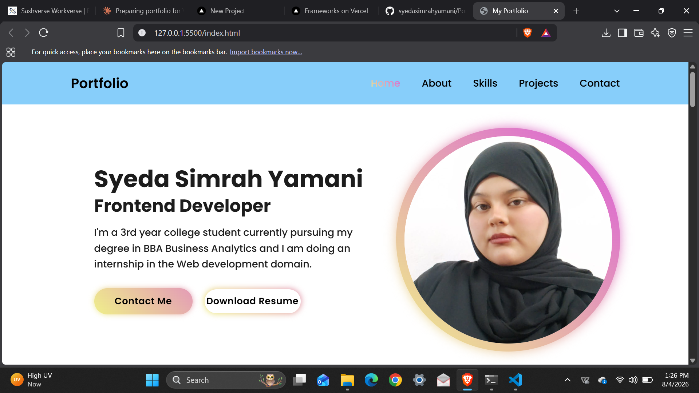

# Simrah's Portfolio

Personal portfolio showcasing my projects and skills.

## 🔗 Live Demo

portfolio-website-steel-seven-30.vercel.app

## 📖 About

This is my personal portfolio website, built to showcase my projects, skills, and background. It's designed to give visitors a quick overview of who I am and what I can do.

## 🛠️ Built With

- HTML
- CSS

## 📁 Folder Structure

portfolio/
├── index.html
├── README.md
├── css/
│ └── style.css
├── images/
│ └── (all image assets)
└── docs/
└── resume.pdf

## 🚀 Running Locally

1. Clone this repository

   git clone https://github.com/syedasimrahyamani/Portfolio-Website.git

2. Open the project folder
3. Open `index.html` using the **Live Server** extension in VS Code (or simply double-click the file to open it in your browser)

## 📬 Contact

- Name: Simrah
- Email: [syedasimrahyamani@gmail.com]
  (mailto:syedasimrahyamani@gmail.com)
- LinkedIn:[Simrah Yamani] (https://www.linkedin.com/in/simrah-yamani-502800347)
- GitHub: [syedasimrahyamani](https://github.com/syedasimrahyamani)

## 📸 Preview

